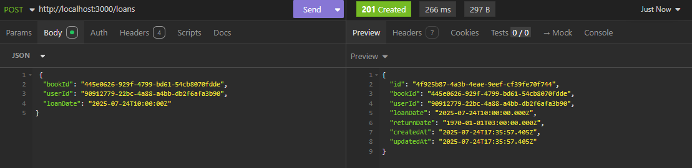
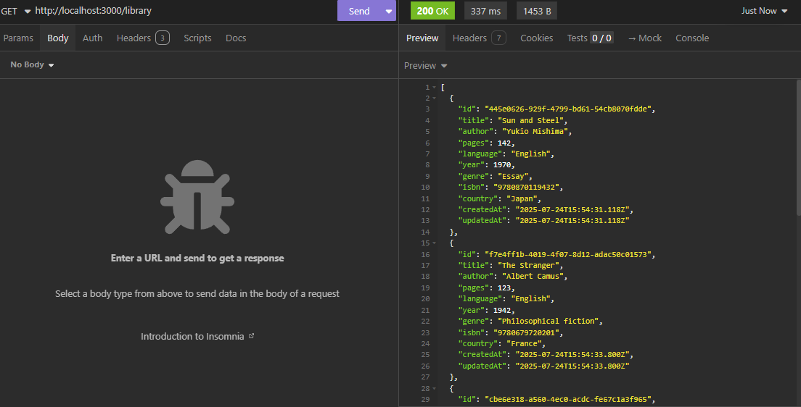
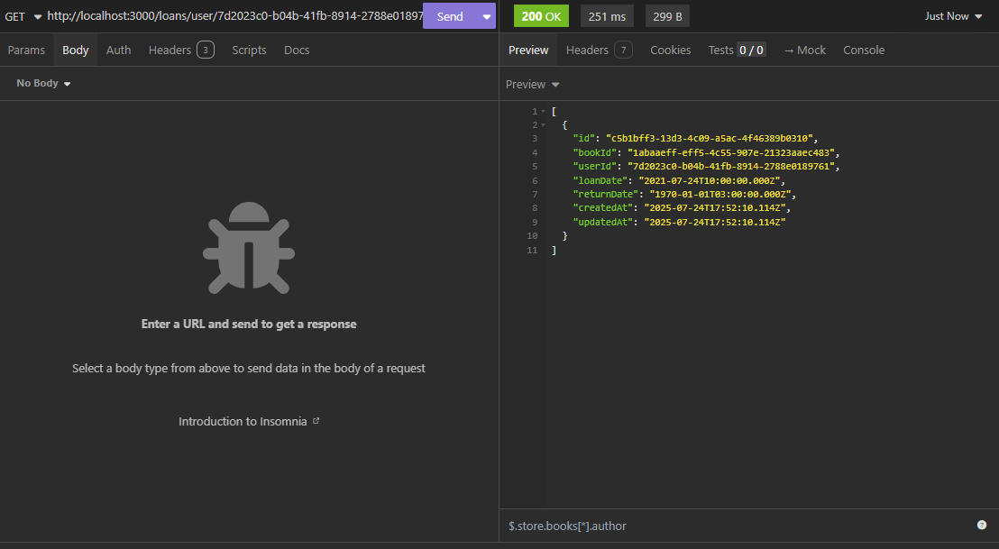
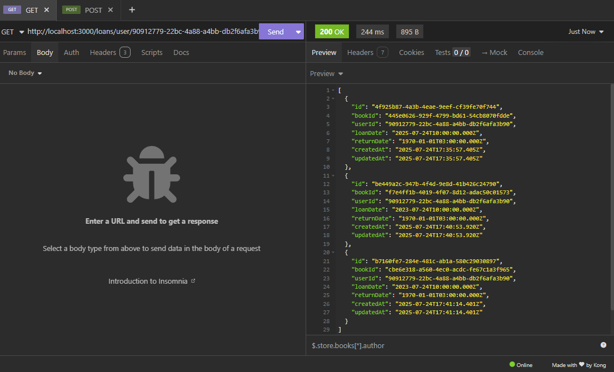

# Ejercicios Prácticos: 
Crear un sistema de gestión de biblioteca

---

## Ejercicio 1 y 2: Modelar entidades y relaciones

```prisma
model Book {
  id        String   @id @default(uuid()) @db.Uuid
  title     String
  author    String
  pages     Int
  language  String
  year      Int
  genre     String
  isbn      String
  country   String
  createdAt DateTime @default(now()) @map("created_at")
  updatedAt DateTime @updatedAt @map("updated_at")
  Loan      Loan[]

  @@map("books")
}

model User {
  id        String   @id @default(uuid()) @db.Uuid
  name      String
  email     String
  createdAt DateTime @default(now()) @map("created_at")
  updatedAt DateTime @updatedAt @map("updated_at")
  Loan      Loan[]

  @@map("users")
}

model Loan {
  id         String   @id @default(uuid()) @db.Uuid
  bookId     String   @map("book_id") @db.Uuid
  userId     String   @map("user_id") @db.Uuid
  book       Book     @relation(fields: [bookId], references: [id])
  user       User     @relation(fields: [userId], references: [id])
  loanDate   DateTime @map("loan_date")
  returnDate DateTime @map("return_date")
  createdAt  DateTime @default(now()) @map("created_at")
  updatedAt  DateTime @updatedAt @map("updated_at")

  @@map("loans")
}
```

---

## Ejercicio 3: Usar Prisma Client para

- Registrar un nuevo préstamo


- Consultar libros disponibles


- Mostrar historial de préstamos por usuario

